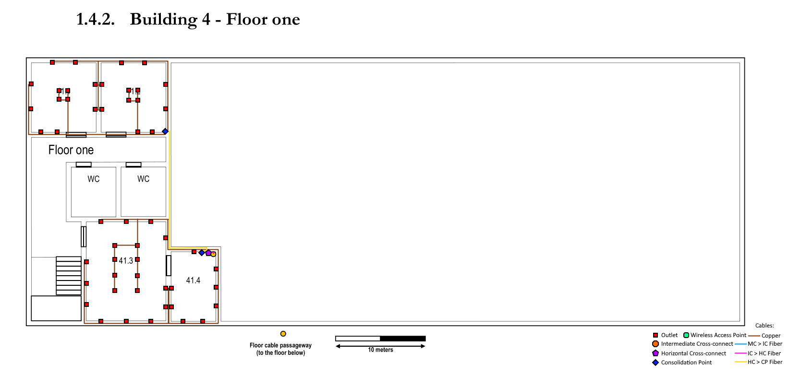

RCOMP 2020-2021 Project - Sprint 1 - Member 1170640 folder
===========================================
## Edifício 4

### Medições das Plantas (Escala - 2.1cm -> 10m)

| Medidas | C (cm)  | L (cm)  | C (m)     | L (m)     | A (m²)      | Outlets |
|---------|---------|---------|-----------|-----------|-------------|-----|
| 40.1    | 1,5     | 1,6     | 7,142857  | 7,619048  | 54,421770   | 12  |
| 40.2    | 1,5     | 1,6     | 7,142857  | 7,619048  | 54,421770   | 12  |
| 40.3    | 1,6     | 1,6     | 7,619048  | 7,619048  | 58,049892   | 12  |
| 40.4    | 1,3     | 1,6     | 6,190476  | 7,619048  | 47,165534   | 10  |
| 41.1    | 1,5     | 1,6     | 7,142857  | 7,619048  | 54,421770   | 12  |
| 41.2    | 1,5     | 1,6     | 7,142857  | 7,619048  | 54,421770   | 12  |
| 41.3    | 2,3     | 1,8     | 10,952381 | 8,571429  | 93,877556   | 20  |
| 41.4    | 1,0     | 1,6     | 4,761905  | 7,619048  | 36,281183   |  8  |
| AREA ABERTA |     |         |           |           |             |     |
| PEQUENO | 1,1     | 4,2     | 5,238095  | 20,000000 | 104,761900  |     |
| GRANDE  | 11,9    | 6,0     | 56,666667 | 28,571429 | 1619,047653 |     |
| TOTAL   |         |         |           |           | 1723,809553 | 346 |
|         |         |         |           |           || TOTAL DE OUTLETS |
|         |         |         |           |           |             | 444 |

## Piso 0 (Ground Floor)

#### Inventário:
- CAT6A Cable (2710 meters)
- Fibre Cable
  - 100GbaseLR10 (120 meters)
  - 40GbaseSR4 (110 meters)
  - 10GbaseSR (285 meters)
- Half Rack Enclosure (x12)
- Full Rack Enclosure (x1)
- Wireless Access Point (x3)
- Fibre Cable Outlet (x3) (para uso dos WAP)
- Copper Cable Outlet (x392)
- Copper Cable Patch Panel (48 ports) (x13)
- Fibre Cable Patch Panels (24 ports) (x4)
- Switch (x17)
  - 13 serving as CP
  - 3 serving as HC
  - 1 serving as IC

#### Metodologia

Neste andar, temos a fibra vinda do edifício central que liga ao IC que se encontra na sala 40.4. Nesta está também o HC que cobre a zona das salas individuais 40.1 a 4, assim como também um dos WAP (com dupla linha para failover) e o CP que distribui a ligação pelos outlets das salas 40.3 e 40.4. Esta quantidade de hardware requer que a sala 40.4 tenha uma full rack enclosure para o seu equipamento, com uma half rack enclosure na sala 40.2.
De seguida, falamos da sala aberta do lado direito. Quatro linhas de fibra saem do IC para esta zona para alimentar os dois HC desta zona, cada um com uma linha extra para casos de failover. De seguida, dos HC localizados nesta zona, saem cabos de fibra para alimentar cada CP, dois quais existe um por cada corredor de tomadas que este cobre, assim como duas linhas para os respetivos WAP da sua zona. Todos os pontos com hardware de switching usam half rack enclosures.

## Piso 1 (Top Floor)

#### Inventário:
- CAT6A Cable (785 meters)
- 10GbaseSR Fibre Cable (20 meters)
- Half Rack Enclosure (x2)
- Copper Cable Outlet (x52)
- Copper Cable Patch Panel (48 ports) (x2)
- Fibre Cable Patch Panels (24 ports) (x1)
- Switch (x3)
  - 2 serving as CP
  - 1 serving as HC

#### Metodologia

No andar superior, em termos de infraestrutura, repete-se praticamente o que se utilizou na zona das salas do piso inferior - recebemos 2 cabos de fibra do HC do andar de baixo (um deles para efeitos de failover) que se liga ao HC na sala 41.4 que serve todo o andar de cima. Este liga, por fibra aos dois CP que cobrem as salas 41.3-4 e 41.1-2. Esta área apenas requer apenas 2 half rack enclosures, uma na sala 41.4 e outra na sala 41.2.

#### Comentários

- Em termos da sala central, existia formas de reduzir o número de CP utilizados. No entanto, esta solução foi a escolhida pois as outras ou se demonstravam mais desorganizadas em termos de planeamento, ou iriam pôr uma sobrecarga nos CP que poderia ser muito mais disruptor em caso de falha de hardware ou linha.
- Em termos de cobertura de WI-FI, devido à falta de ferramentas 3D e plantas que se pudesse usar que nos desse uma boa sensação de altura do edifício, não se consegue afirmar com todas as certezas que os WAP do andar de baixo cubram toda a área do andar de cima, especificamente, o canto superior esquerdo da sala 41.1. Caso essa deficiência se manifeste, recomendo um WAP no andar de cima, na mesma localização (latitude e longitude) onde se encontra o WAP do andar de baixo que cobre as salas 40.1 a 4.
- Em termos de redundância, podíamos ter feito cabelagens em caminhos isolados, mas visto que não nos foi requerido nem nos é indicado que este edifício irá ser utilizado para funções críticas, decidi não contemplar no plano.
