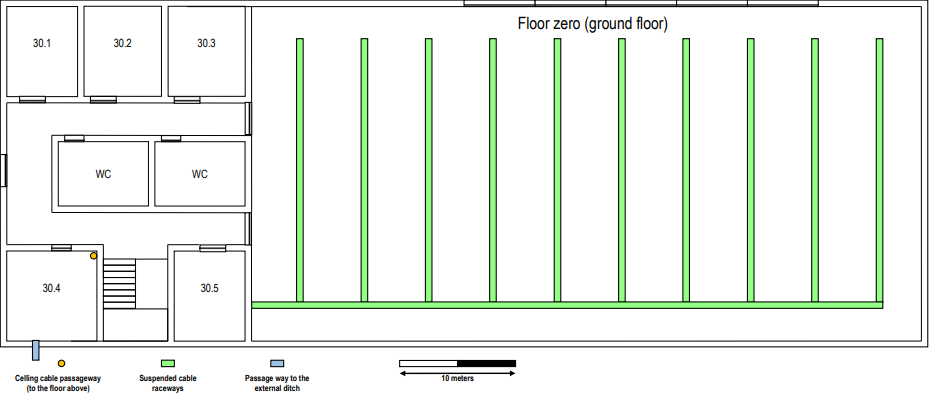
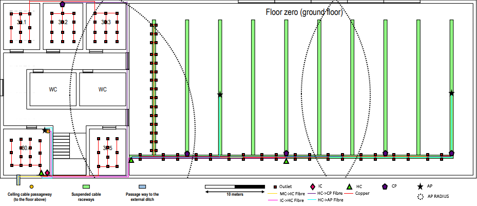
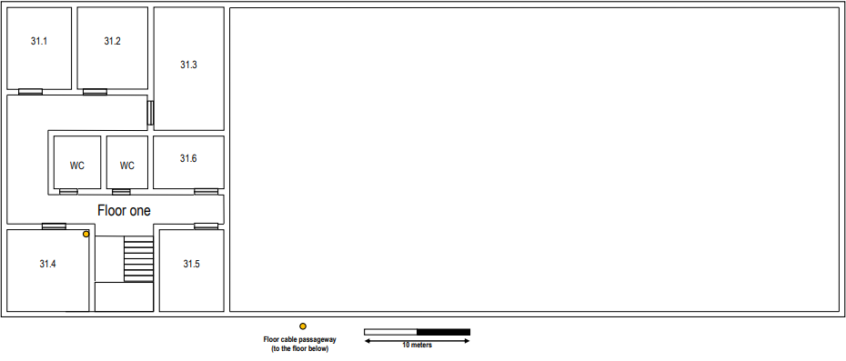
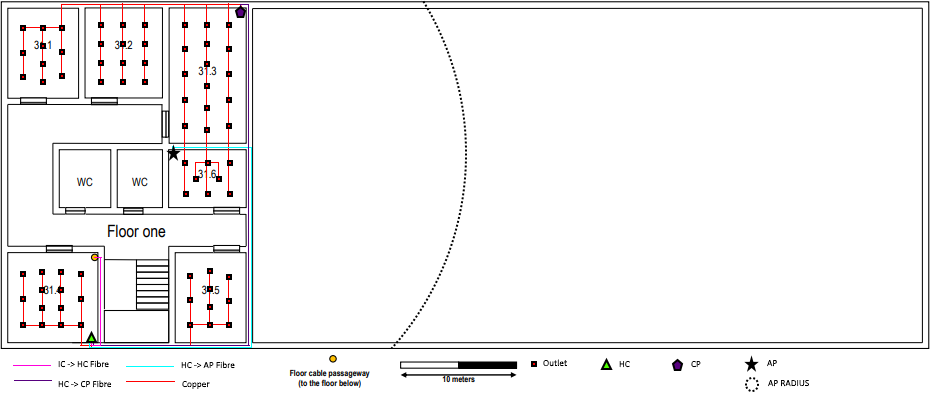

RCOMP 2020-2021 Project - Sprint 1 - Member 1182147 Folder
===========================================
## Building 3

For this particular Sprint, I was in charge of designing a structured cabling deployment plan for a given physical environment. In this case, Building #3.

### Glossary

- MC -> Main Cross-Connect
- IC -> Intermediate Cross-Connect
- HC -> Horizontal Cross-Connect
- CP -> Consolidation Point
- AP -> Access Point

### Blueprint Measurements (Scale - 2.9cm <=> 10m)

| Room | Length (cm)  | Width (cm)  | Real Length (m) | Real Width (m) | Area (m²) | Outlets |
|------|--------------|-------------|-----------------|----------------|-----------|---------|
| Floor 0 | | | | | | |
| 30.1 | 1,80 | 2.25 | 6.21 | 7.76 | 48.19 | 10 |
| 30.2 | 1.95 | 2.25 | 6.72 | 7.76 | 52.15 | 12 |
| 30.3 | 1.95 | 2.25 | 6.72 | 7.76 | 52.15 | 12 |
| 30.4 | 2.30 | 2.25 | 7.93 | 7.76 | 61.54 | 14 |
| 30.5 | 1.80 | 2.25 | 6.21 | 7.76 | 48.19 | 10 |
| Floor 1 | | | | | | |
| 31.1 | 1.80 | 2.25 | 6.21 | 7.76 | 48.19 | 10 |
| 31.2 | 1.95 | 2.25 | 6.72 | 7.76 | 52.15 | 12 |
| 31.3 | 1.95 | 3.40 | 6.72 | 11.72 | 78.76 | 16 |
| 31.4 | 2.30 | 2.25 | 7.93 | 7.76 | 61.54 | 14 |
| 31.5 | 1.80 | 2.25 | 6.21 | 7.76 | 48.19 | 10 |
| 31.6 | 1.95 | 1.45 | 6.72 | 5.00 | 33.60 | 8 |
| Open Area | 16.90 | 8.40 | 58.20 | 28.97 | 1686.05 | 338 |

### Floor 0

For this particular floor, I decided to place the IC in room 30.4 due to its proximity to the ceiling cable passageway, allowing me to design the
cabling deployment in such a way that it solely required one IC to power both floors of the building.

In regards to the placements of the HCs, the justification for their placements were as follows:

- HC in room 30.4 - Considering the left area of this floor has an area below 1000m2, in order to maintain proximity to the IC with the purpose of enclosing them
	in the same Telecommunications Enclosure and to comfortably power the southern outlets directly while powering the northern area through a CP. An argument could be
	made that, since the traversal of the CAT6A copper wires to the northern area wouldn't surpass the recommended 80m, that it could power those outlets directly.
	However, since signal naturally wavers down the farther it travels, I deemed it appropriate to supply a CP instead.
- HC in left part of Open Area - Considering the open area has an area of over 1000m2, I decided to split the area in 2 sections.
	This HC powers the leftmost 2 CPs while maintaining an area of control below 1000m2.
- HC in right part of Open Area - Same reason as stated above, but to the rightmost 2 CPs.
	
Regarding the placements of the CPs, the justification for their placements were as follows:

- CP in room 30.2 - To avoid having the HC in room 30.4 powering all outlets in the left side of the floor, I centered this CP in the northern area
	in order to maintain as leveled of a signal strength as strong as possible to the northern rooms (i.e. 30.1, 30.2 and 30.3).
- CPs in the Open Area - In order to maintain the corresponding Patchpanels within a maximum of 128 ports, each CP (except the rightmost one),
	powers 3 lanes (30x3 outlets) and 12 on the main suspended raceway corridor. While the rightmost CP powers solely the rightmost lane and the
	last 2 rightmost outlets on the suspended raceway corridor.
	
As to the placement of the APs, they were deemed the best placements in order to attain full Wi-fi coverage of the floor, while avoiding deadzones.

*Note: The outlet (and cabling) schematic of the leftmost lane of suspended cable raceway is to be repeated across all other lanes. It was presented in this way as to avoid image clutter.*

#### Floor 0 Inventory

* Telecommunication Enclosure (IC + HC - 8U)
	* 1 Optic Fibre -> CAT6A Switch w/24 Ports - 1U
	* 1 Patch Panel w/24 Ethernet Ports - 1U
	* 1 Patch Panel w/6 Optic Fibre Ports - 1U
* 2 Telecommunication Enclosures (HC - 4U)
	* 1 Patch Panel w/4 Optic Fibre Ports - 1U
* 3 Telecommunication Enclosures (CP - 32U)
	* 1 Optic Fibre -> CAT6A Switch w/128 Ports - 8U
	* 1 Patch Panel w/128 Ports - 8U
* Telecommunication Enclosure (CP - 8U)
	* 1 Optic Fibre -> CAT6A Switch w/48 Ports - 2U
	* 1 Patch Panel w/48 Ports - 2U
* 3 AP
* 399 Outlets
	* 396 RJ45 Outlets
	* 3 Optic Fibre Outlets
* 396 CAT6A Patch Cords
* 5320 meters CAT6A Copper Wire
* 150 meters Optic Fibre Wire Category 100GbaseSR10 (for IC -> HC connection)
* 440 meters Optic Fibre Wire Category 40GbaseSR4 (for HC -> CP and HC -> AP connections)

*Note: The Optic Fibre measurement requirements already takes into account redundancy.*

*Note2: While it is acknowledged in the schematic that MC -> IC connection exists, it is not taken into account in this particular inventory.*
	
### Floor 1

For this particular floor, the reasoning for the placement of the HC is the same as the one located in floor 0 at room 30.4.

In regards to the CP, it now powers 4 rooms instead of 3 (such as the one in room 30.2 of floor 0) and, therefore, is centered accordingly.

As to the placement of the AP, it is centered on the left area of floor 1 in room 31.6 as to maintain the signal strength equally across the floor.

### Floor 1 Inventory

* Telecommunication Enclosure (HC - 8U)
	* 1 Optic Fibre -> CAT6A Switch w/24 Ports - 1U
	* 1 Patch Panel w/24 Ethernet Ports - 1U
	* 1 Patch Panel w/4 Optic Fibre Ports - 1U
* Telecommunication Enclosure (CP - 8U)
	* 1 Optic Fibre -> CAT6A Switch w/48 Ports - 2U
	* 1 Patch Panel w/48 Ports - 2U
* 1 AP
* 71 Outlets
	* 70 RJ45 Outlets
	* 1 Optic Fibre Outlet
* 70 CAT6A Patch Cords
* 920 meters CAT6A Copper Wire
* 20 meters Optic Fibre Wire Category 100GbaseSR10 (for IC -> HC connection)
* 170 meters Optic Fibre Wire Category 40GbaseSR4 (for HC -> CP and HC -> AP connections)

*Note: The Optic Fibre measurement requirements already takes into account redundancy.*