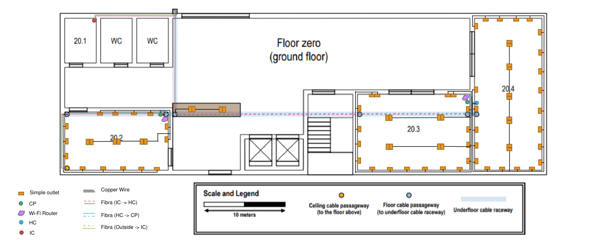
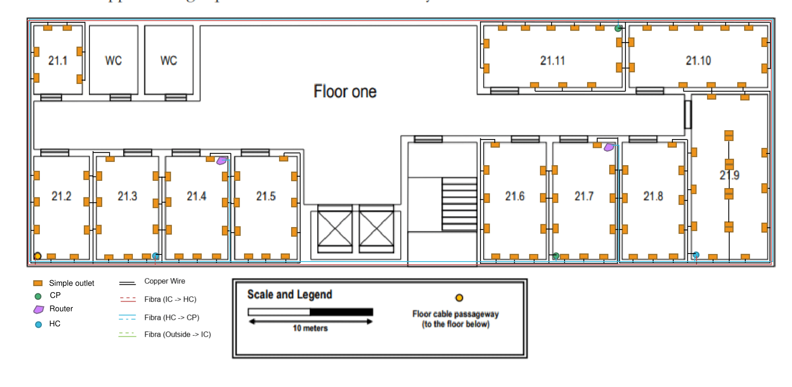

RCOMP 2019-2020 Project - Sprint 1 - Member 1190743 folder
===========================================

## Edifício B

Para este projeto, fiquei encarregue de cobrir o Edifício B.
Os Access Points estão distribuidos de maneira a cobrir totalmente o edifício,
no piso 1 existem 3 AP devido à necessidade de atravessar um grande número de
obstáculos. 

## Piso 0 (Ground Floor)

### Medidas:

|         | C_imagem (cm) | L_imagem (cm) | C_real (m) | L_real (m) | Área (m²) | Outlets |
|---------|---------|---------|--------|--------|--------|---------|
| B0      |         |         | 60     | 20     | 1200   | 82      |
| 20.2    | 3,62    | 2,1     | 12,75  | 7,2    | 91,8   | 20      |
| 20.3    | 4       | 2,7     | 13,8   | 9,3    | 128,34 | 26      |
| 20.4    | 2,4     | 5,35    | 8,27   | 18,62  | 153,99 | 32      |
| Desk    | 2,4     | 0,5     | 8,27   | 1,37   | 11,33  | 4       |

### Inventário:
* 1 IC
* 1 HC:
    * 2 Switch Fibra Ótica 48 Portas
    * 2 Patch Panel Fibra Ótica 48 portas
* 2 CP:
    * 2 Switch 48 portas
    * 2 Patch Panel 48 portas
* 82 outlets

## Piso 1

### Medidas:

|         | C_real (m) | L_real (m) | Área (m²) | Outlets |
|---------|--------|--------|--------|---------|
| B1      | 60     | 20     | 1172   | 116     |
| 21.1    | 3,8    | 5,5    | 20,9   | 6       |
| 21.2    | 4,48   | 8,27   | 37,05  | 8       |
| 21.3    | 5      | 8,27   | 41,35  | 10      |
| 21.4    | 5      | 8,27   | 41,35  | 10      |
| 21.5    | 5      | 8,27   | 41,35  | 10      |
| 21.6    | 5      | 9,31   | 46,55  | 10      |
| 21.7    | 5      | 9,31   | 46,55  | 10      |
| 21.8    | 5      | 9,31   | 46,55  | 10      |
| 21.9    | 6,13   | 13,10  | 80,30  | 18      |
| 21.10   | 11,03  | 4,83   | 53,28  | 12      |
| 21.11   | 11,03  | 4,83   | 53,28  | 12      |

### Inventário:
* 1 HC:
    * 2 Switch Fibra Ótica 48 Portas
    * 2 Patch Panel Fibra Ótica 48 portas
* 3 CP:
    * 2 Switch 24 portas
    * 2 Patch Panel 24 portas
    * 1 Switch 48 portas
    * 1 Patch Panel 48 portas
* 116 outlets

