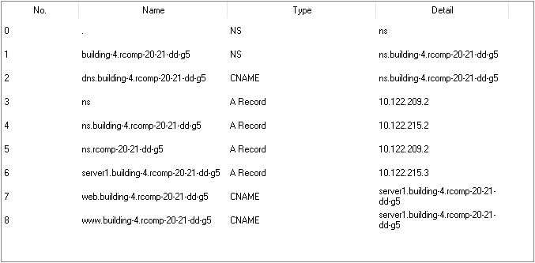

RCOMP 2020-2021 Project - Sprint 3 - Member 1171060 folder
===========================================
# BUILDING 4

In this document there will be all the commands I used to configurate different devices. The IPs for the servers are on their notes.

# OSPF COMMANDS #

    router ospf 1
    network 10.122.214.0 0.0.1.255 area 4

# DHCP / DNS COMMANDS #

    ip dhcp excluded-address 10.122.214.1
    ip dhcp excluded-address 10.122.214.65
    ip dhcp excluded-address 10.122.214.129
    ip dhcp excluded-address 10.122.214.193

    ip dhcp pool VLAN151
    network 10.122.214.0 255.255.255.192
    default-router 10.122.214.1
    dns-server 10.122.215.2
    omain-name building-4.rcomp-20-21-dd-g5

    ip dhcp pool VLAN152
    network 10.122.214.64 255.255.255.192
    default-router 10.122.214.65
    dns-server 10.122.215.2
    domain-name building-4.rcomp-20-21-dd-g5

    ip dhcp pool VLAN153
    network 10.122.214.128 255.255.255.192
    default-router 10.122.214.129
    dns-server 10.122.215.2
    domain-name building-4.rcomp-20-21-dd-g5

    ip dhcp pool VLAN155
    network 10.122.214.192 255.255.255.192
    default-router 10.122.214.193
    option 150 ip 10.122.214.193
    dns-server 10.122.215.2
    domain-name building-4.rcomp-20-21-dd-g5

# VoIP COMMANDS #
(Switchport configuration for the switch was already in place on sprint 2)

    telephony-service
    auto-reg-ephone
    ip source-address 10.122.214.193 port 2000
    max-ephones 20
    max-dn 20
    auto assign 11 to 12

    ephone-dn 11
    number 4001

    ephone-dn 12
    number 4002

    dial-peer voice 1000 voip
    destination-pattern 1...
    session target ipv4:10.122.209.193

    dial-peer voice 2000 voip
    destination-pattern 2...
    session target ipv4:10.122.211.129

    dial-peer voice 3000 voip
    destination-pattern 3...
    session target ipv4:10.122.212.193

# DNS #

# NAT COMMANDS #

    ip nat inside source static tcp 10.122.215.3 80 120.57.210.186 80
    ip nat inside source static tcp 10.122.215.3 443 120.57.210.186 443
    ip nat inside source static tcp 10.122.215.2 53 120.57.210.186 53
    ip nat inside source static udp 10.122.215.2 53 120.57.210.186 53
